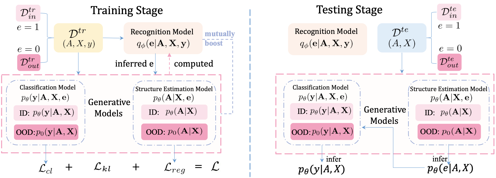

# GraphDE
Official implementation for our paper:

GraphDE: A Generative Framework for Debiased Learning and Out-of-Distribution Detection on Graphs

Zenan Li, Qitian Wu, Fan Nie, Junchi Yan* (* denotes correspondence)

*Advances in Neural Information Processing Systems* (**NeurIPS 2022**)

## Overview

**GraphDE** is a plug-in module to tackle two critical but largely unexplored problems for graph data: **debiased learning** and **OOD detection**. 

In this paper, we find the fundamental correlations between these two problems and define them under a probabilistic framework. 

We model the generative process to characterize the distribution shifts of graph data, along with an environment variable as an indicator. Utilizing variational inference, we propose to infer the environment variable during the training procedure of GNN. The induced learning objective enables us to solve these two problems simultaneously.



## Environment

- Main packages: Python 3.8, PyTorch 1.10.0, PyTorch-Geometric 2.1.0.
- See `requirements.txt` for other packages.

## Dataset

- Spurious-Motif: this dataset can be generated via `spmotif_gen/spmotif.py`. Note that you need to generate ID `SPMotif-{bias}`, OOD mixed `SPMotif-mixed-{bias}` and OOD testing files `SPMotif-ood-{bias}` according to our paper to run the code.
- Collab: this dataset will be automatically downloaded during training.
- MNIST-75sp: this dataset can be downloaded [here](https://drive.google.com/drive/folders/1Prc-n9Nr8-5z-xphdRScftKKIxU4Olzh). Download `mnist_75sp_train.pkl`, `mnist_75sp_test.pkl`, and `mnist_75sp_color_noise.pt` to the directory `data/MNISTSP/raw/`.
- DrugOOD: this dataset should be generated from the guide in [DrugOOD](https://github.com/tencent-ailab/DrugOOD). We use the built-in configuration file, namely, `lbap_general_ic50_scaffold.py` to generate the dataset.

## Run GraphDE

The hyper-parameters used to train GraphDE have been discussed in detail in our paper. Please refer to `argparse.ArgumentParser` in the training files to set them. We use separate files to train on each dataset.

Notably, the debiased learning and OOD detection procedure are integrated in our pipeline. Simply run `python -m train.{dataset}_de (--graphde_a ...)` to reproduce results in the paper.

## Reference

```bibtex
      @inproceedings{li2022graphde,
      title = {GraphDE: A Generative Framework for Debiased Learning and Out-of-Distribution Detection on Graphs},
      author = {Zenan Li and Qitian Wu and Fan Nie and Junchi Yan},
      booktitle = {Advances in Neural Information Processing Systems (NeurIPS)},
      year = {2022}
      }
```

## Acknowledgements

We sincerely thank these repositories: [DIR-GNN](https://github.com/Wuyxin/DIR-GNN) for its well-implemented pipeline, and [GLOD-Issues](https://github.com/LingxiaoShawn/GLOD-Issues), [GLocalKD](https://github.com/RongrongMa/GLocalKD) which are adopted as our detection baseline. 
